# SwiftUI memo

#### Table of Contents
1. [Navigation Bar](#NavigationBar)
2. [State](#State)
3. [Form and Section](#form-and-section)
4. [Picker](#picker)
5. [Button](#button)
6. [Alert](#alert)
7. [SwiftUI use struct](#swiftui-use-struct)
8. [Modifier order](#Modifier-Order)
9. [Views as properties](#Views-as-properties)
10. [View composition](#View-composition)
11. [Custom Modifier](./CustomModifier/README.md)
12. [Custom ContentView](./CustomContentView/README.md)

## NavigationBar
```swift
struct ContentView: View {
    var body: some View {
        Form{
            Text("hi there")
        }
    }
}
```


```swift
struct ContentView: View {
    var body: some View {
        NavigationView{
            Form{
                Text("hi there")
            }
        }
    }
}
```


```swift
struct ContentView: View {
    var body: some View {
        NavigationView{
            Form{
                Text("hi there")
            }.navigationBarTitle("Nav-title")
        }
    }
}
```


```swift
struct ContentView: View {
    var body: some View {
        NavigationView{
            Form{
                Text("hi there")
            }.navigationBarTitle("Nav-title", displayMode: .inline)
        }
    }
}
```


[Back to top](#Table-of-Contents)

## State
State make variable become mutable

### Immutable
```swift
struct ContentView: View {
    var body: some View {
        var name = ""
        Form {
            TextField("Enter your name", text: name)
            Text("Hello World")
        }
    }
}
```
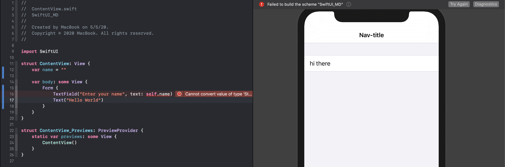

### Mutable - two way binding
```swift
struct ContentView: View {
    @State private var name = ""

    var body: some View {
        Form {
            TextField("Enter your name", text: $name)
            Text("Hello World \(name)")
        }
    }
}
```
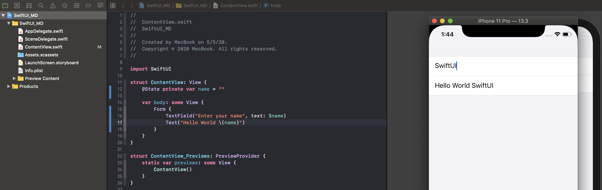

[Back to top](#Table-of-Contents)

## Form and Section
Chỉ chấp nhận 10 rows trong 1 Form hoặc section
```swift
struct ContentView: View {
    var body: some View {
        NavigationView{
            Form {
                Section{
                    Text("Row")
                    Text("Row")
                    Text("Row")
                    Text("Row")
                    Text("Row")
                    Text("Row")
                    Text("Row")
                    Text("Row")
                    Text("Row")
                    Text("Row")
                }
                Section{
                    Text("Row")
                    Text("Row")
                    Text("Row")
                    Text("Row")
                    Text("Row")
                    Text("Row")
                    Text("Row")
                    Text("Row")
                    Text("Row")
                    Text("Row")
                }
            }.navigationBarTitle("ForEach")
        }
    }
}
```
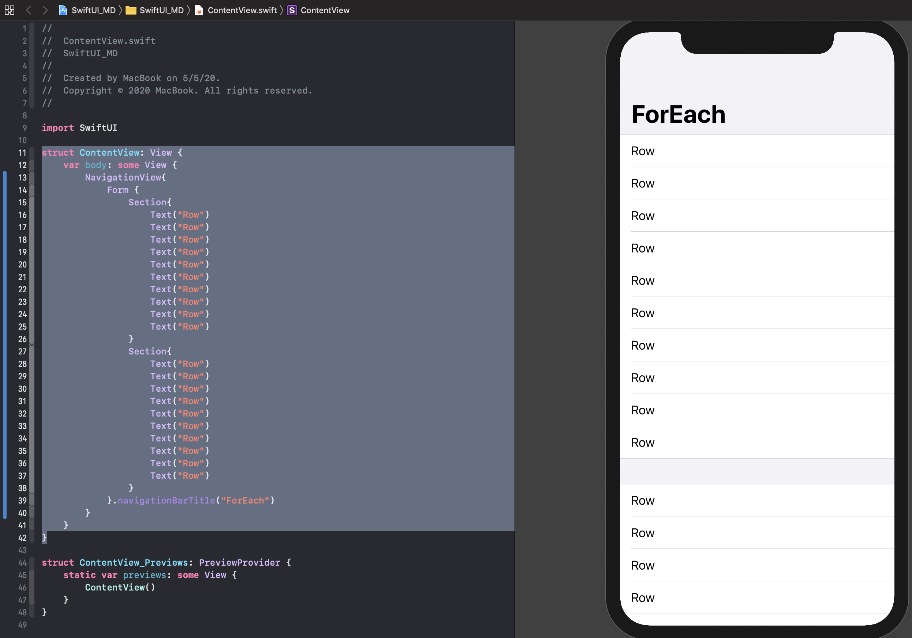

Nếu muốn nhiều hơn 10 row trong 1 form thì sử dụng ForEach
```swift
struct ContentView: View {
    var body: some View {
        NavigationView{
            Form {
                ForEach(0 ..< 20) {
                    Text("Row \($0)")
                }
            }
            .navigationBarTitle("ForEach")
        }
    }
}
```
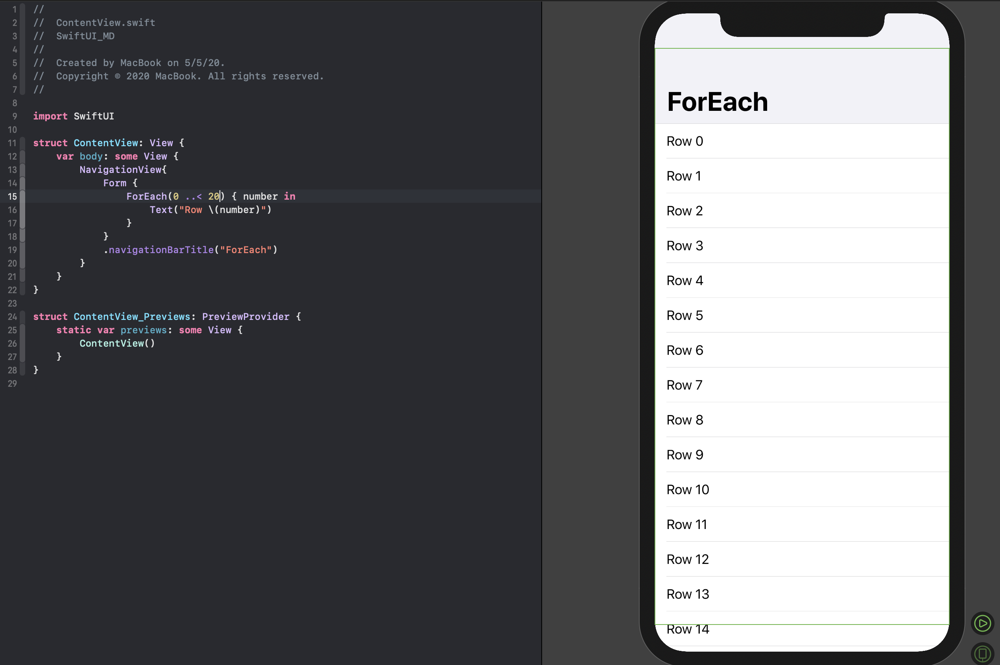

[Back to top](#Table-of-Contents)

## Picker
Normal picker
```swift
struct ContentView: View {
    @State private var numberOfPeople = 5
    
    var body: some View {
        Picker("Number of people", selection: $numberOfPeople) {
            ForEach(0 ..< 10) {
                Text("\($0) people")
            }
        }
    }
}
```
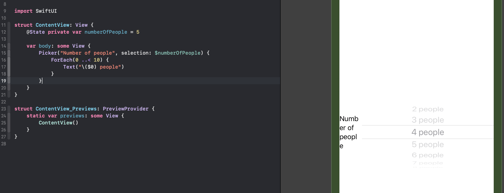

Đặt picker trong form → phải đặt form trong navigation view
```swift
struct ContentView: View {
    @State private var numberOfPeople = 5
    
    var body: some View {
        NavigationView {
            Form {
                Section {
                    Picker("Number of people", selection: $numberOfPeople) {
                        ForEach(2 ..< 100) {
                            Text("\($0) people")
                        }
                    }
                }
            }.navigationBarTitle("Picker")
        }
    }
}
```
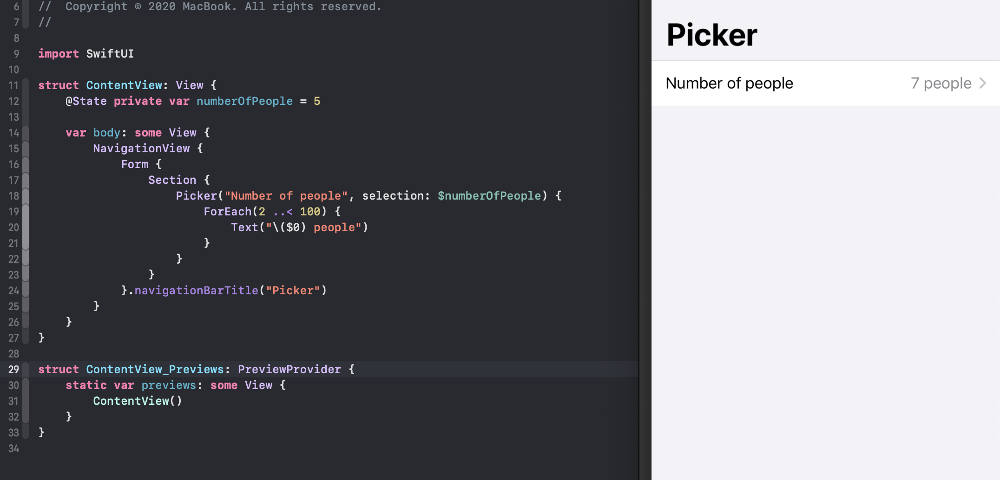

Segmented Picker Style & section header

```swift
struct ContentView: View {
    @State private var percentages = ["10%", "20%", "30%", "40%", "50%"]
    @State private var firstIndex = 2
    
    var body: some View {
        NavigationView {
            Form {
                Section(header: Text("choose one")) {
                    Picker("Segmented Picker Style", selection: $firstIndex) {
                        ForEach(0..<percentages.count) {
                            Text("\(self.percentages[$0])")
                        }
                    }.pickerStyle(SegmentedPickerStyle())
                }
            }.navigationBarTitle("Picker")
        }
    }
}
```

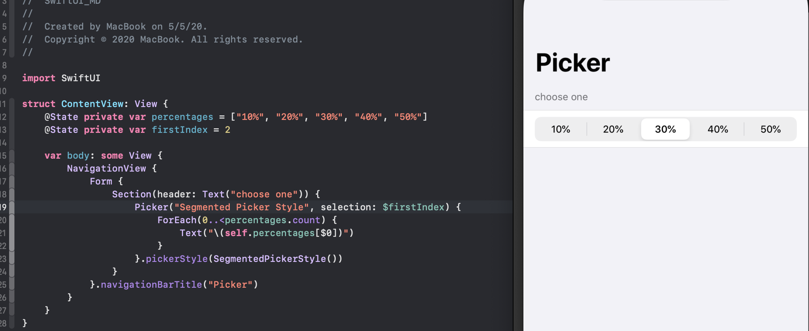

Conclusion
get binding value from picker
```swift
struct ContentView: View {
    private let percentages = ["10%", "20%", "30%", "40%", "50%"]
    @State private var percentIndex = 2
    @State private var peopleIndex = 2
    
    var body: some View {
        NavigationView {
            Form {
                
                Section{
                    Picker("Number of people", selection: $peopleIndex) {
                        ForEach(0..<10, id: \.self) {
                            Text("\($0) people")
                        }
                    }
                }
                
                Section(header: Text("choose one")) {
                    Picker("Segmented Picker Style", selection: $percentIndex) {
                        ForEach(0..<percentages.count, id: \.self) {
                            Text("\(self.percentages[$0])")
                        }
                    }.pickerStyle(SegmentedPickerStyle())
                }
                
                Section{
                    Text("\(peopleIndex) - \(percentages[percentIndex])")
                }
                
            }.navigationBarTitle("Picker")
        }
    }
}
```

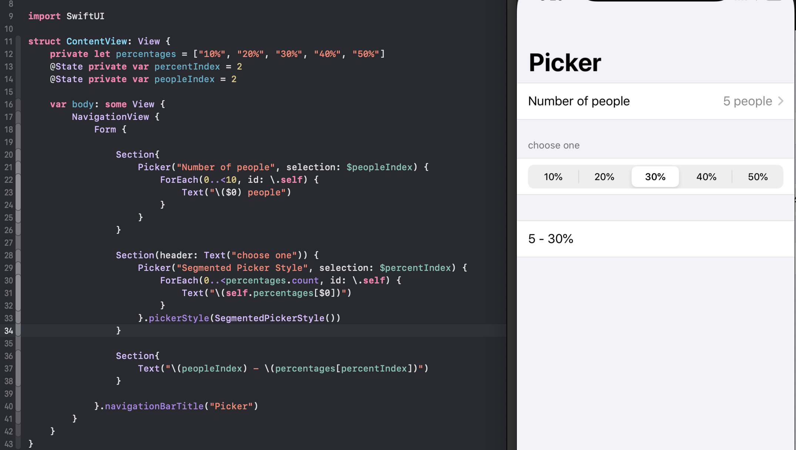

[Back to top](#Table-of-Contents)

## Button
```swift
struct ContentView: View {
    
    var body: some View {
        Button(action: {
            print("button action")
        }) {
            HStack(spacing: 40){
                Image(systemName: "pencil")
                Text("Press")
            }
        }
    }
}
```
[Back to top](#Table-of-Contents)

## Alert

```swift
struct ContentView: View {
    
    @State private var showingAlert = false
    
    var body: some View {
        Button("Show Alert") {
            self.showingAlert = true
        }
        .alert(isPresented: $showingAlert) {
            Alert(title: Text("Hello SwiftUI!"), message: Text("This is some detail message"), dismissButton: .default(Text("OK")) {
                print("alert button action")
                })
        }
    }
}
```

[Back to top](#Table-of-Contents)

## SwiftUI use Struct

UIKit là class chứa khoảng 200 properties
SwiftUI là struct và hoàn toàn không có properties nào.
Ví dụ:
```swift
struct ContentView: View {
    
    @State private var showingAlert = false
    
    var body: some View {
        Text("Hello World")
    }
}
```
View trên không có property nào để set background color.
Bắt buộc phải dùng component khác với frame full màn hình và set color cho component đó.

VD như trường hợp bên dưới là set color cho ZStack
```swift
struct ContentView: View {
    
    @State private var showingAlert = false
    
    var body: some View {
        ZStack{
            Color.orange
            Text("Hello World")
        }.edgesIgnoringSafeArea(.all)
    }
}
```

## Modifier Order

SwiftUI render theo thứ tự từng dòng code

```swift
struct ContentView: View {
    
    @State private var showingAlert = false
    
    var body: some View {
        Button("Button") {
            
        }
        .background(Color.red)
        .frame(width:200, height: 200)
    }
}
```

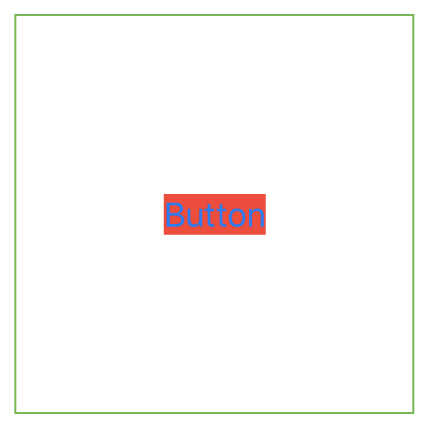

```swift
struct ContentView: View {
    
    @State private var showingAlert = false
    
    var body: some View {
        Button("Button") {
            
        }
        .frame(width:200, height: 200)
        .background(Color.red)
    }
}
```

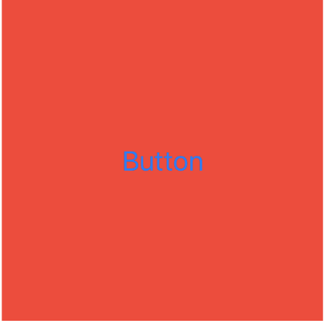

```swift
struct ContentView: View {
    
    @State private var showingAlert = false
    
    var body: some View {
        Text("modifier order")
            .padding()
            .background(Color.red)
            .padding()
            .background(Color.orange)
            .padding()
            .background(Color.blue)
    }
}
```

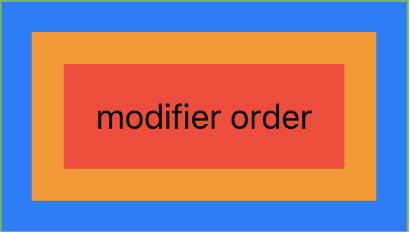

[Back to top](#Table-of-Contents)

## Views as properties

```swift
struct ContentView: View {
    
    let view1 = Text("Text from view 1")
    let view2 = Text("Text from view 2")
    
    var body: some View {
        VStack{
            view1
                .foregroundColor(.blue)
            view2
                .foregroundColor(.red)
        }
    }
}
```

[Back to top](#Table-of-Contents)

## View composition

```swift
struct ContentView: View {
    
    let view1 = Text("Text from view 1")
    let view2 = Text("Text from view 2")
    
    var body: some View {
        VStack(spacing: 10) {
            CapsuleText(text: "First")
            CapsuleText(text: "Second")
        }
    }
}

struct CapsuleText: View {
    var text: String

    var body: some View {
        Text(text)
            .font(.largeTitle)
            .padding()
            .foregroundColor(.white)
            .background(Color.blue)
            .clipShape(Capsule())
    }
}
```

```swift
struct ContentView: View {
    
    let view1 = Text("Text from view 1")
    let view2 = Text("Text from view 2")
    
    var body: some View {
        VStack(spacing: 10) {
            CapsuleText(text: "First")
                .foregroundColor(.yellow)
            CapsuleText(text: "Second")
                .foregroundColor(.red)
        }
    }
}

struct CapsuleText: View {
    var text: String

    var body: some View {
        Text(text)
            .font(.largeTitle)
            .padding()
            .background(Color.blue)
            .clipShape(Capsule())
    }
}
```

[Back to top](#Table-of-Contents)
