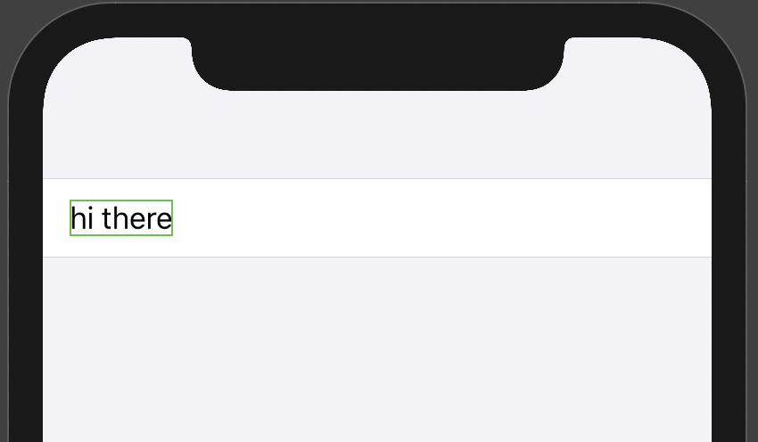
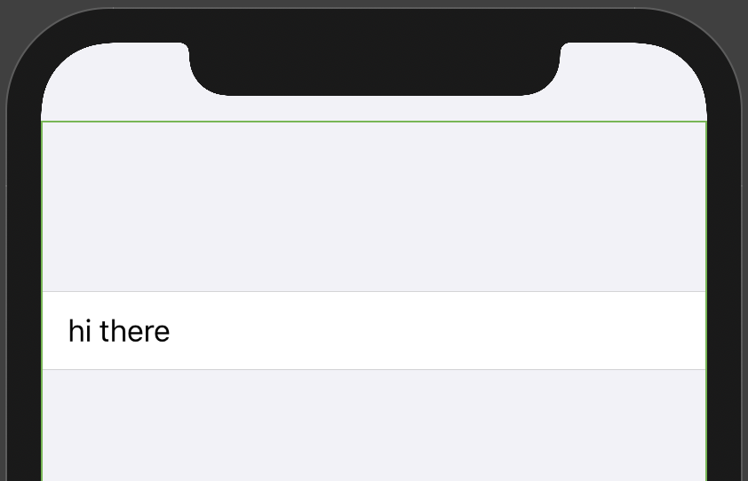
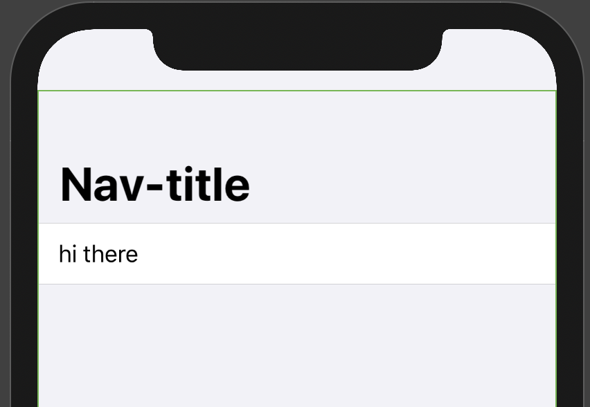
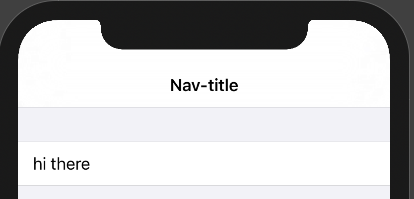

# SwiftUI memo

## Adding a navigation bar
```swift
struct ContentView: View {
    var body: some View {
        Form{
            Text("hi there")
        }
    }
}
```


```swift
struct ContentView: View {
    var body: some View {
        NavigationView{
            Form{
                Text("hi there")
            }
        }
    }
}
```


```swift
struct ContentView: View {
    var body: some View {
        NavigationView{
            Form{
                Text("hi there")
            }.navigationBarTitle("Nav-title")
        }
    }
}
```


```swift
struct ContentView: View {
    var body: some View {
        NavigationView{
            Form{
                Text("hi there")
            }.navigationBarTitle("Nav-title", displayMode: .inline)
        }
    }
}
```
